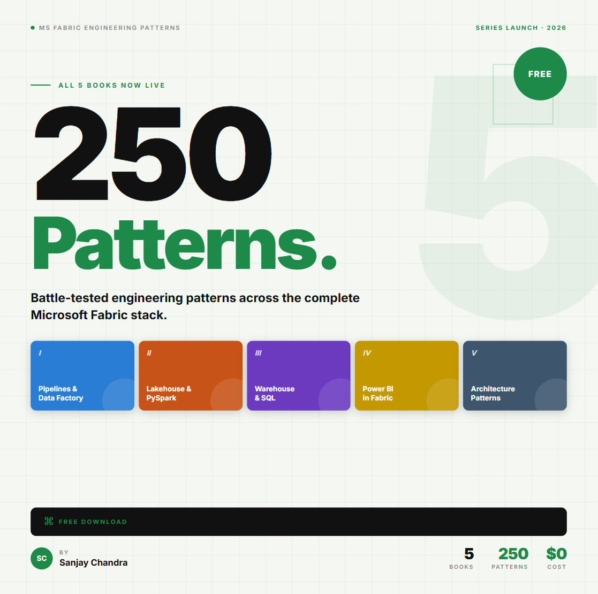
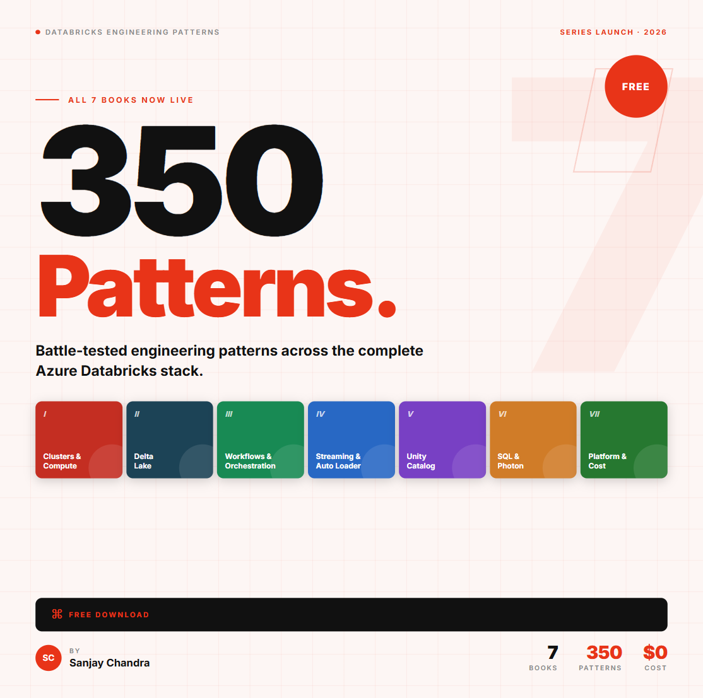
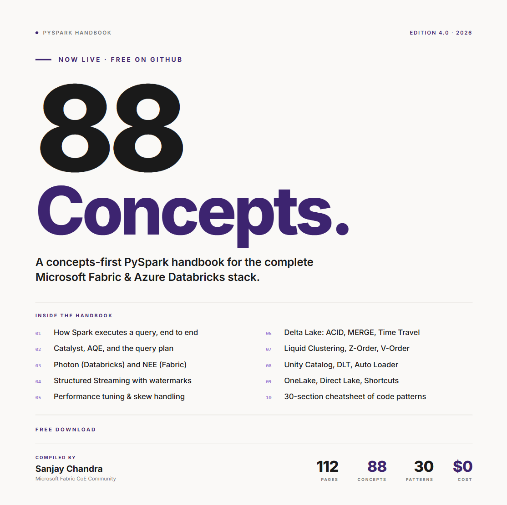

# Data Engineering Patterns

Field notes from real data platform engagements. Microsoft Fabric, Azure Databricks, and PySpark. Free.

Every pattern names the assumption that quietly breaks production, explains what is actually happening under the hood, and gives you the decision to make instead.

Whether you are sitting an interview, stabilizing a live platform, or designing your first lakehouse, these are the patterns that separate a pipeline that runs from one you can trust.

> **One repository for everything data engineering.** This is the single home for all of my data engineering material. Microsoft Fabric, Azure Databricks, and PySpark today, with more platforms, tools, and patterns added over time. Star the repo and check back as it grows.

---

## Microsoft Fabric Patterns

  

250 patterns spanning Pipelines, Lakehouse, Warehouse, Power BI, and the architecture decisions that tie them together.

| # | Topic | Download |
|---|---|---|
| 1 | Pipelines and Data Factory | [Download PDF](https://github.com/ssanjaychandra123/data-engineering-patterns/blob/main/Fabric%20Patterns/Fabric%20Engineering%20Patterns%20Book%20I%20-%20Pipelines%20and%20Data%20Factory%20by%20Sanjay%20Chandra.pdf) |
| 2 | Lakehouse and PySpark | [Download PDF](https://github.com/ssanjaychandra123/data-engineering-patterns/blob/main/Fabric%20Patterns/Fabric%20Engineering%20Patterns%20Book%20II%20-%20Lakehouse%20and%20PySpark%20by%20Sanjay%20Chandra.pdf) |
| 3 | Warehouse and SQL | [Download PDF](https://github.com/ssanjaychandra123/data-engineering-patterns/blob/main/Fabric%20Patterns/Fabric%20Engineering%20Patterns%20Book%20III%20-%20Warehouse%20and%20SQL%20by%20Sanjay%20Chandra.pdf) |
| 4 | Power BI in Fabric | [Download PDF](https://github.com/ssanjaychandra123/data-engineering-patterns/blob/main/Fabric%20Patterns/Fabric%20Engineering%20Patterns%20Book%20IV%20-%20Power%20BI%20in%20Fabric%20by%20Sanjay%20Chandra.pdf) |
| 5 | Architecture Patterns | [Download PDF](https://github.com/ssanjaychandra123/data-engineering-patterns/blob/main/Fabric%20Patterns/Fabric%20Engineering%20Patterns%20Book%20V%20-%20Architecture%20Patterns%20by%20Sanjay%20Chandra.pdf) |

---

## Azure Databricks Patterns

  

350 patterns covering the full platform, from clusters and Delta Lake through Unity Catalog governance to the architecture and cost choices that keep it sustainable.

| # | Topic | Download |
|---|---|---|
| 1 | Clusters and Compute | [Download PDF](https://github.com/ssanjaychandra123/data-engineering-patterns/blob/main/Databricks%20Patterns/Azure%20Databricks%20Engineering%20Patterns%20Book%20I%20-%20Clusters%20and%20Compute%20by%20Sanjay%20Chandra.pdf) |
| 2 | Delta Lake | [Download PDF](https://github.com/ssanjaychandra123/data-engineering-patterns/blob/main/Databricks%20Patterns/Azure%20Databricks%20Engineering%20Patterns%20Book%20II%20-%20Delta%20Lake%20by%20Sanjay%20Chandra.pdf) |
| 3 | Workflows and Orchestration | [Download PDF](https://github.com/ssanjaychandra123/data-engineering-patterns/blob/main/Databricks%20Patterns/Azure%20Databricks%20Engineering%20Patterns%20Book%20III%20-%20Workflows%20and%20Orchestration%20by%20Sanjay%20Chandra.pdf) |
| 4 | Structured Streaming and Auto Loader | [Download PDF](https://github.com/ssanjaychandra123/data-engineering-patterns/blob/main/Databricks%20Patterns/Azure%20Databricks%20Engineering%20Patterns%20Book%20IV%20-%20Structured%20Streaming%20and%20Auto%20Loader%20by%20Sanjay%20Chandra.pdf) |
| 5 | Unity Catalog | [Download PDF](https://github.com/ssanjaychandra123/data-engineering-patterns/blob/main/Databricks%20Patterns/Azure%20Databricks%20Engineering%20Patterns%20Book%20V%20-%20Unity%20Catalog%20by%20Sanjay%20Chandra.pdf) |
| 6 | Databricks SQL and Photon | [Download PDF](https://github.com/ssanjaychandra123/data-engineering-patterns/blob/main/Databricks%20Patterns/Azure%20Databricks%20Engineering%20Patterns%20Book%20VI%20-%20Databricks%20SQL%20and%20Photon%20by%20Sanjay%20Chandra.pdf) |
| 7 | Platform and Cost Architecture | [Download PDF](https://github.com/ssanjaychandra123/data-engineering-patterns/blob/main/Databricks%20Patterns/Azure%20Databricks%20Engineering%20Patterns%20Book%20VII%20-%20Platform%20and%20Cost%20Architecture%20by%20Sanjay%20Chandra.pdf) |

---

## PySpark

  

88 concepts across 112 pages. A practical, concepts first companion for engineers writing production Spark across Fabric and Databricks.

| Title | Download |
|---|---|
| The PySpark Handbook for Fabric and Databricks | [Download PDF](https://github.com/ssanjaychandra123/data-engineering-patterns/blob/main/PySpark/The%20PySpark%20Handbook%20for%20Fabric%20and%20Databricks%20by%20Sanjay%20Chandra.pdf) |

---

Found a gap or something that has moved on? Open an issue. These platforms evolve quickly and I keep the material current.

---

Sanjay Chandra builds and advises on enterprise data platforms. If your team is wrestling with one of these problems at scale, let us talk.

[LinkedIn](https://www.linkedin.com/in/ssanjaychandra/) · [ssanjaychandra.com](http://www.ssanjaychandra.com)
